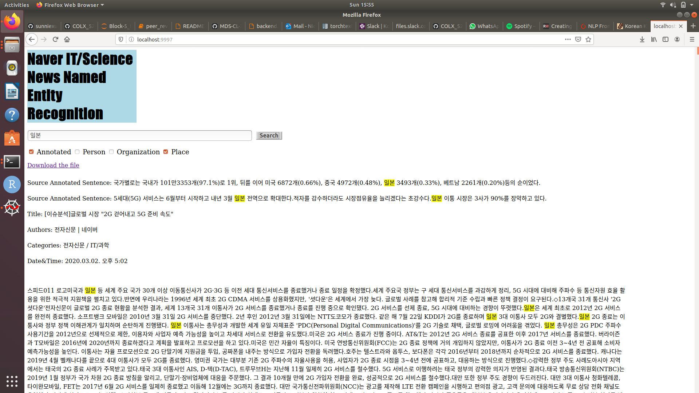

# Directions and Use

- Make sure all files were cloned/downloaded from the repo

- Run the backend.py from terminal and connect to localhost:9997 in a browser (If this port is taken then you can change the port within backend.py)

- To search for documents that have a certain keyword, type or copy paste a keyword into the search bar and click search (this will return the top 10 sorted documents, according to keyword frequency).

- To highlight the annotation, check the 'Annotated' box and relevant category box (i.e. 'Place'), and then search as you did before. This will also provide examples of the source annoted sentences that this named entity appears in.

### Example of Input

# Other ideas for input:

- 카카오 (Kakao, Organization)
- 한국 (Korea, Place)
- 이만희 (Lee Man-hee, Person)
